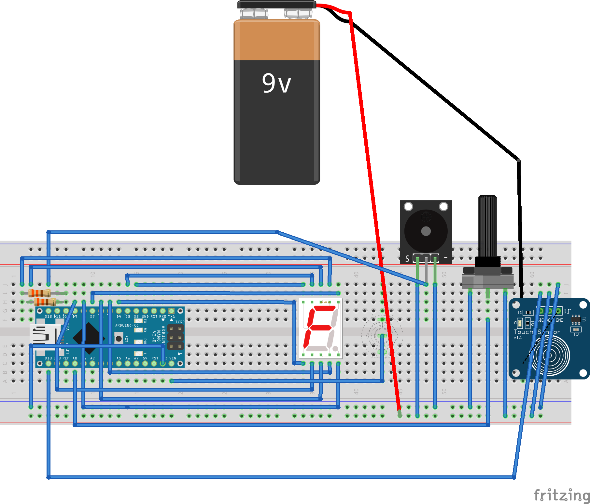

# ScrumTimer

## Summary
This project is a timer for scrum daily standups.
Based on team size and needs the timer can be configured from 1 to 99 seconds. The current time left is shown on a 2 digit 7 SEG display.
To start or stop the timer, a touch module can be pressed.

## Details
* The logic is implemented for Arduino.
* Arduino Nano is suitable for this project
* The 3D printing case models (soon to come) are also designed for the size of an Arduino Nano.

## Material
* Arduino Nano
* Poti
* 2x330 Ohm resistor
* Resisitive Touch module
* On/Off switch
* 9V Battery
* 2 digit 7 SEG display
* Passive Buzzer module

## Wiring

Please note the 7SEG should be two-digit. I just couldn't find a module in fritzing for it. The wiring is the same.
